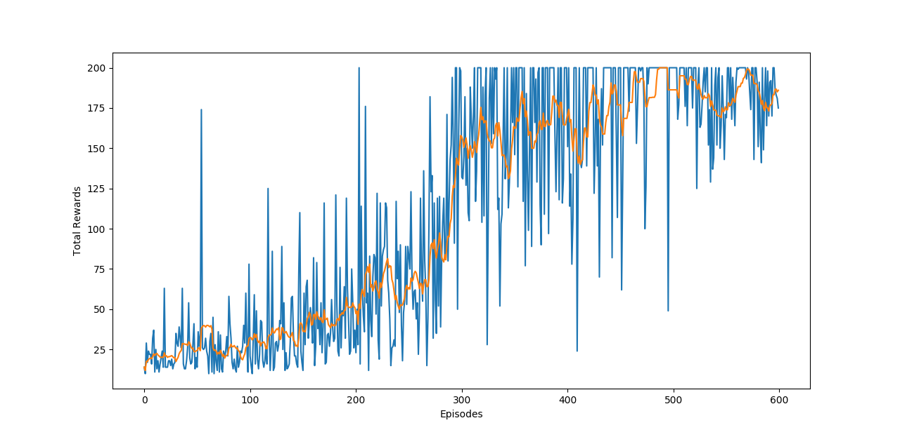

# Policy-Gradient-PyTorch
Implementation of vanilla stochaistic (categorical) policy gradient algorithm to play cartpole.  
Vanilla policy gradient takes longer but convergence is smoother than DQN for the cartpole, both of these properties as expected.  

